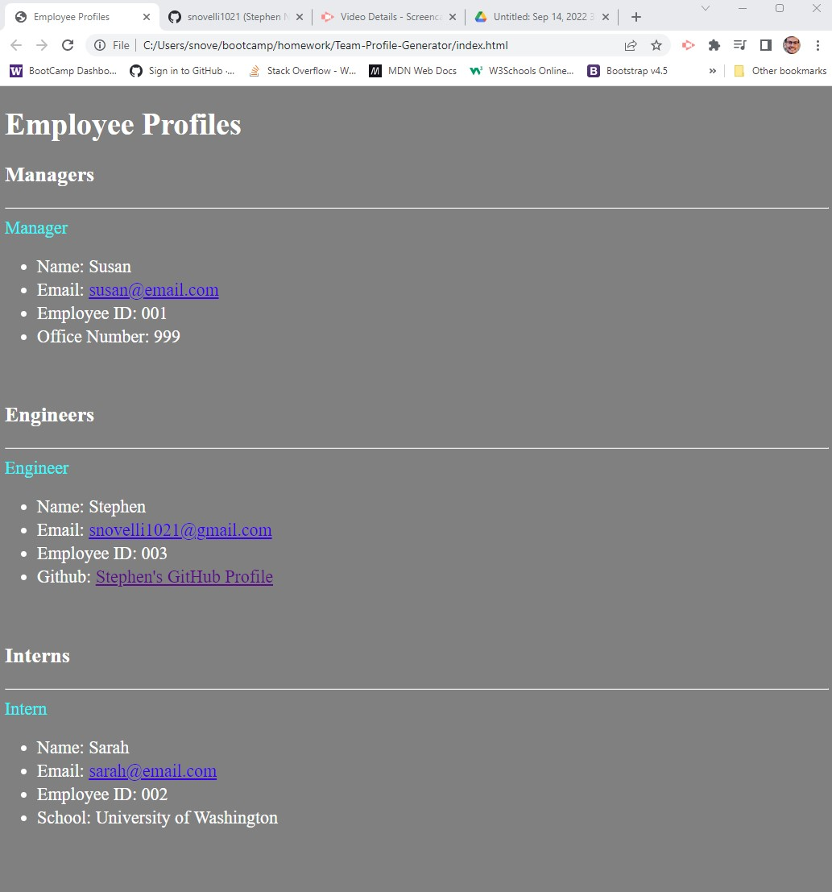

UW Coding Bootcamp Module 10 Challenge: Team Profile Generator

The team profile generator uses inquirer to promp a user to add a class of Employee to an output HTML page. Employee has subclasses of manager, engineer, and intern which are all tested to pass a true value of Employee using unit tests.

[GitHub Repo: ](https://github.com/snovelli1021/Team-Profile-Generator)

[GitHub Pages: ](https://snovelli1021.github.io/Team-Profile-Generator/)

[Screencastify Video Demo: ](https://drive.google.com/file/d/1pMH3XXiEWhYkHM-_6MY_O0QQhSXBJ6-P/view)